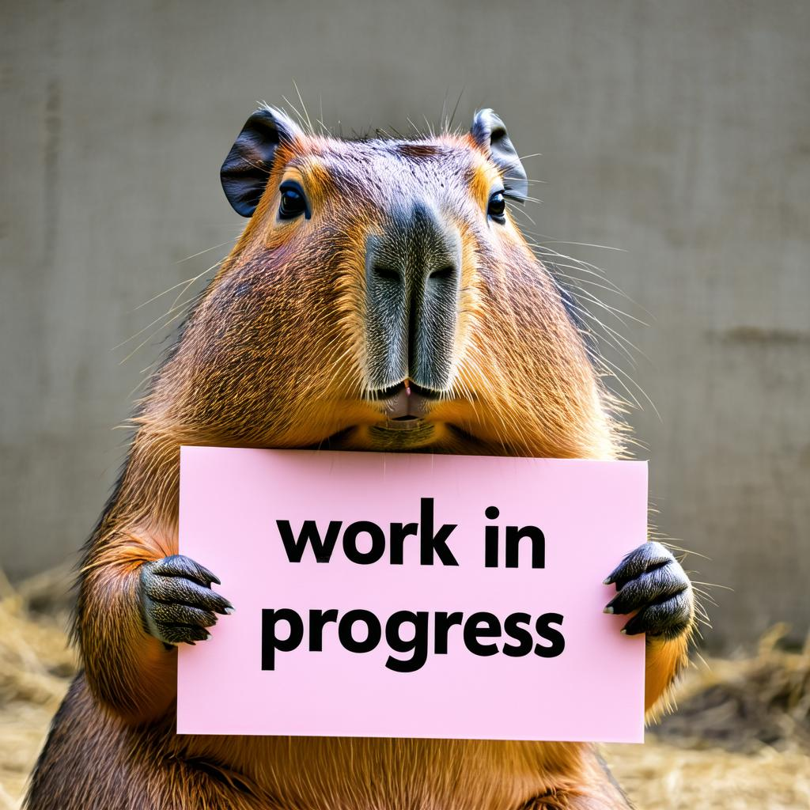

# U-Net Architecture

!!! example "Under Development"
    

## Overview
The U-Net architecture is a fundamental component of our diffusion model implementation. This section will provide detailed insights into its structure and implementation.

!!! tip "Want to Contribute?"
    We'd love your help! Check out our [contribution guidelines](../getting_started/installation.md) 
    to help make this documentation even better! 🌟
